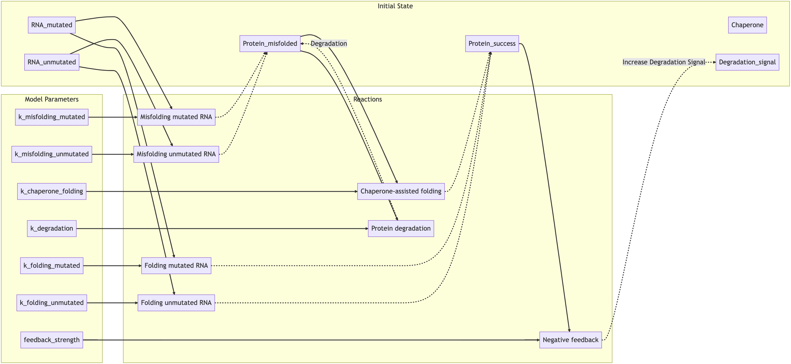
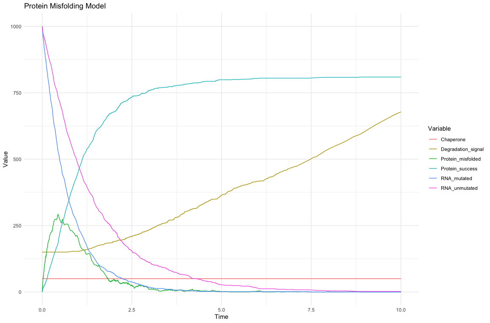
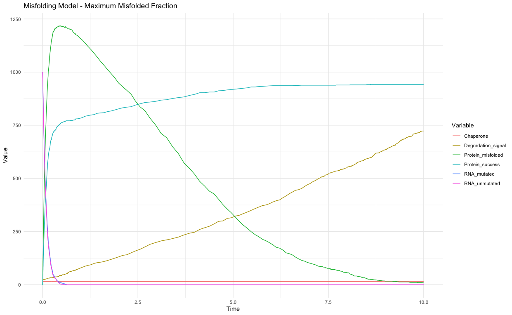

```{r setup, include=FALSE}
knitr::opts_chunk$set(echo = TRUE, warning = FALSE, message = FALSE)

packages_required <- c("bookdown", "tidyverse", "adaptivetau", "lhs", "kableExtra")
not_installed <- packages_required[!(packages_required %in% installed.packages()[ , "Package"])]
if(length(not_installed)) install.packages(not_installed)   

library(bookdown)
library(tidyverse)
library(adaptivetau)
library(lhs)
library(kableExtra)
```

```{r, include = FALSE}
load("../output/lhs_simulation.RData")
# set.seed(7004)
```

## 1.0 Introduction
Protein misfolding, an integral molecular event where proteins fail to fold into their functional, tertiary structure, is involved in the pathogenesis of numerous neurodegenerative diseases, including Alzheimer’s, Parkinson’s, and Huntington’s disease (Chung et al., 2018). Aggregation and accumulation of these misfolded proteins, along with degradation dysfunction (Koh et al., 2019) in neurons, cause cellular toxicity and ultimately lead to neuronal death, contributing directly to the presentation of these diseases. Substantial research efforts have been made in an attempt to design therapeutics to treat neurodegenerative diseases, but the complex nature of protein misfolding, aggregation, and the resulting cellular response remain incompletely understood.

Therapeutic efforts have focused on varying stages of the protein lifecycle including targeting misfolding and aggregation, chaperone expression, and degradation pathways. However, ambiguity surrounding which form(s) of protein are responsible for a given disease, diversity of chaperone mechanisms, and the sheer number of proteins involved in degradation pathways pose a formidable challenge in the pursuit of disease treatment development (Sweeney et al., 2017).

The stochastic model presented in this report, albeit simplified, investigates protein folding and misfolding dynamics by integrating key processes such as protein synthesis, folding, misfolding, chaperone-assisted refolding, and degradation. The model provides a generalised framework to study the effects of individual parameters on the rate and extent of protein misfolding and aims to offer insight into how different cellular states may contribute to protein aggregation and toxicity causing neurodegenerative diseases. This model will be utilised to screen parameter space using Latin Hypercube Sampling and investigate what combination of parameters in the modelled system leads to the highest fraction of misfolding. 

## 2.0 Methods
Preliminary background research was conducted on the mechanisms of protein folding in order to create a biologically representative model. Lehninger Principles of Biochemistry (Nelson et al., 2021) was utilised to create a framework of the most prominent mechanisms before proceeding. Due to the extremely complex nature of the protein folding and degradation pathways, numerous simplifications, which are discussed in section [3.2](#ref), were made. Seven parameters and their effect on protein folding would be investigated in this model. Figure \@ref(fig:diagram) shows a flow diagram that was created to determine the inputs, outputs, and relationships to be modelled.
```{r diagram, echo = FALSE, fig.cap="A flow diagram showing the relationship between all inputs and outputs of the stochastic model"}

```

Once the design of the model was finalised, the constituent parts were developed as follows. Firstly, system parameters such as folding, misfolding, degradation, and feedback rates were modelled. The folding constants for misfolding have been assigned higher values than the constants for successful folding due to the propensity for misfolding in neurodegenerative diseases (Sweeney et al., 2017).
```{r}
# Model parameters
params <- c(
  k_folding_unmutated = 0.4,         # Folding rate constant for proteins from unmutated RNA
  k_folding_mutated = 0.5,           # Folding rate constant for proteins from mutated RNA
  k_misfolding_unmutated = 0.4,      # Misfolding rate constant for proteins from unmutated RNA
  k_misfolding_mutated = 0.9,        # Misfolding rate constant for proteins from mutated RNA
  k_chaperone_folding = 0.02,        # Chaperone-assisted folding rate constant
  k_degradation = 0.02,              # Protein degradation rate constant
  feedback_strength = 0.0001         # Feedback strength for negative feedback
)
```
Protein folding rates are determined by their 3-dimensional, or tertiary, structure complexity (Wang & Panagiotou, 2022) along with a plethora of other factors. The rates chosen here demonstrate the protein folding model and its dynamics as generally as possible for a cell in a steady-state. Real values of these parameters would need to be derived from experimental data depending on the type of cell being studied. 

The initial state of the system was similarly chosen to be simplistic, but biologically representative. Each of the variables in the `init` object represents the quantity or concentration of a component of the system at time zero.
```{r}
# Initial state of the system
init <- c(
  RNA_unmutated = 1000,            # Number of unmutated RNA molecules present
  RNA_mutated = 1000,              # Number of mutated RNA molecules present
  Protein_success = 0,             # Number of successfully folded proteins
  Protein_misfolded = 0,           # Number of misfolded proteins
  Chaperone = 50,                  # Number of chaperones available
  Degradation_signal = 150         # Initial level of the degradation signal
)
```
The propensity function calculates the rate at which each reaction can occur given the current state of the system at that point in time in relation to the parameters. This function calculates the rates of all possible events in the model such as protein folding, misfolding, degradation, and negative feedback.
```{r}
# Propensity function
propensity_function <- function(state, params, t) {
  return(c(
    # Folding reaction for proteins translated from unmutated RNA
    params[["k_folding_unmutated"]] * state[["RNA_unmutated"]],
    # Folding reaction for proteins translated from mutated RNA
    params[["k_folding_mutated"]] * state[["RNA_mutated"]],
    # Misfolding reaction for proteins translated from unmutated RNA
    params[["k_misfolding_unmutated"]] * state[["RNA_unmutated"]],
    # Misfolding reaction for proteins translated from mutated RNA
    params[["k_misfolding_mutated"]] * state[["RNA_mutated"]],
    # Chaperone-assisted folding reaction for misfolded proteins
    params[["k_chaperone_folding"]] * state[["Protein_misfolded"]] * state[["Chaperone"]],
    # Protein degradation reaction for misfolded proteins through lysosome-like process
    params[["k_degradation"]] * state[["Protein_misfolded"]] * state[["Degradation_signal"]],
    # Negative feedback reaction that increases the degradation signal when
    # there is a high concentration of successfully folded proteins
    params[["feedback_strength"]] * state[["Protein_success"]]^2
  ))
}
```

The following list updates values in the `init` object depending on the above propensity function reactions as the simulation steps through time.
```{r}
transitions <- list(
  # Folding reaction for proteins translated from unmutated RNA
  c(RNA_unmutated = -1, Protein_success = +1),
  # Folding reaction for proteins translated from mutated RNA
  c(RNA_mutated = -1, Protein_misfolded = +1),
  # Misfolding reaction for proteins translated from unmutated RNA
  c(RNA_unmutated = -1, Protein_misfolded = +1),
  # Misfolding reaction for proteins translated from mutated RNA
  c(RNA_mutated = -1, Protein_misfolded = +1),
  # Chaperone-assisted folding reaction for misfolded proteins
  c(Protein_misfolded = -1, Protein_success = +1),
  # Protein degradation reaction for misfolded proteins through lysosome-like process
  c(Protein_misfolded = -1),
  # Negative feedback reaction that increases the degradation signal when
  # there is a high concentration of successfully folded proteins
  c(Degradation_signal = +1)
)
```

Finally, the initialised parameters, initial conditions, and rates can be used as inputs for the `ssa.adaptivetau` function to perform the stochastic simulation over the specified number of time steps.
```{r}
t_final <- 10   # Final time for the simulation

# run simulation using the adaptive tau-leaping method 
result <- ssa.adaptivetau(init.values = init, 
                          transitions = transitions, 
                          rateFunc = propensity_function, 
                          params = params, 
                          tf = t_final)
```

Table \@ref(tab:output) shows `r t_final` time steps and corresponding values of the state of the system. The head of the dataframe, for reference:
```{r output, echo = FALSE}
result <- as.data.frame(result)
knitr::kable(head(result), 
             caption = "The head of the baseline simulation dataframe after running for 10 time steps using tau-leaping",
             format = "html")
```

### 2.1 Parameter Space Screening
To further investigate and discover the combination of parameters that led to the highest misfolded protein fraction, the parameter space needed to be screened using Latin Hypercube Sampling.

First a range of parameters to be sampled was defined. The values presented here are extreme simplifications that do not account for protein size, complexity, and a variety of other factors, but nevertheless can provide a good approximation of a biological system. Of course, to create an accurate model, these values would need to experimentally derived.
```{r}
# create parameter ranges to sample
param_ranges <- list(
  k_folding_unmutated = c(0.3, 20),
  k_folding_mutated = c(0.9, 30),
  k_misfolding_unmutated = c(0.4, 7),
  k_misfolding_mutated = c(1, 10),
  k_chaperone_folding = c(0.001, 0.05),
  k_degradation = c(0.0001, 0.1),
  feedback_strength = c(0.000001, 0.01)
)
```

Then 10000 samples were created for each parameter in `param_ranges` which are then used in parameter space screening to investigate the combination of parameters that causes the highest fraction of protein misfolding.
```{r}
# Number of samples
n_samples <- 10000

# Generate normalized LHS samples
lhs_samples <- randomLHS(n_samples, length(param_ranges))

# Scale the samples to the defined parameter ranges
# these param samples are n_samples * the parameter ranges
param_samples <- matrix(NA, nrow = n_samples, ncol = length(param_ranges),
                        dimnames = list(NULL, names(param_ranges)))


# Loop through the indices of the list of parameter ranges
for (i in seq_along(param_ranges)) {
  # Get the range (min and max) for each parameter
  range_i <- param_ranges[[i]]
  # Generate a random sample of size n_samples from a uniform distribution 
  # with the minimum and maximum values specified by range_i.
  # These random numbers represent sampled values of each parameter, 
  # which are stored in the i-th column of the param_samples matrix.
  param_samples[, i] <- runif(n_samples, min = range_i[1], max = range_i[2])
}
```

Table \@ref(tab:paramsamples) displays the head of `param_samples` dataframe, showing the different combinations of parameter ranges to simulate in parameter space screening.
```{r paramsamples, echo = FALSE}
knitr::kable(head(param_samples),
             caption = "Parameter values that are within the range of values specified to be sampled using the adaptive tau-leaping method",
             format = "html")
```

```{r, echo = FALSE}
t_max <- 10
```

Each row of the resulting `param_samples` dataframe was then simulated using `ssa.adaptivetau` and stored in the `results` vector.
```{r, eval = FALSE}
# Initialize a list of length n_samples to store the results of each simulation
results <- vector("list", length = n_samples)
# Loop over the number of samples
for (i in 1:n_samples) {
  # For each sample, extract the i-th row from the param_samples matrix,
  # which corresponds to the parameter values for the i-th simulation.
  # Convert this row to a list, because the ssa.adaptivetau function expects its parameters in this format.
  params_i <- as.list(param_samples[i, ])
  # Run the stochastic simulation algorithm with the Adaptive Tau method for the current set of parameters.
  # The initial state of the system is given by "init", the set of reactions by "transitions",
  # the propensity function by "propensity_function", the parameters by "params_i", 
  # and the simulation runs until time "t_max".
  # Store the result of the simulation in the i-th element of the results list.
  results[[i]] <- ssa.adaptivetau(init, transitions, propensity_function, params_i, t_max)
}
```

Finally, to determine the system parameters that cause the highest fraction of protein misfolding, the `results` vector was inspected and a new vector was created with fractions of misfolding rates for each simulation. The maximum value from this list was then extracted along with the parameters utilised in that particular simulation.
```{r}
fractions_misfolded <- numeric(length(results))

for (i in seq_along(results)) {
  result <- results[[i]]
  final_state <- result[nrow(result), 4:5] # Get the final state of Protein_success (4th column) and Protein_misfolded (5th column)
  # print(final_state)
  fraction_misfolded <- final_state[2] / sum(final_state) # Calculate the fraction of misfolded proteins
  fractions_misfolded[i] <- fraction_misfolded
}

max_index <- which.max(fractions_misfolded)
max_misfold <- fractions_misfolded[max_index]
optimal_params <- param_samples[max_index, ]
optimal_params$max_misfold <- max_misfold
```

## 3.0 Results
The simulation was run over 10 time steps to inspect the dynamics of the model. Figure \@ref(fig:fullmod) shows RNA, both mutated and unmutated, decrease in concentration as they are recruited in protein production while successfully folded proteins increase in concentration along with misfolded proteins. Misfolded proteins, however, peak in concentration early on and are either refolded by chaperone-assisted folding into successful proteins or degraded via the modelled degradation pathway. The degradation signal increases as successful protein concentration increases to simulate a negative feedback mechanism.

```{r fullmod, fig.cap = "A line plot demonstrating the dynamics of the stochastic model. RNA decreases in concentration as proteins are folded or misfolded and the degradation signal simulating negative feedback as protein concentration increases", echo = FALSE}

```

### 3.1 Parameter Screening
The above simulation represents relatively healthy protein folding and degradation function where all misfolded proteins are either re-folded or degraded by the end of the determined time period. However, stochasticity in this model can lead to events where not all misfolded proteins have been correctly folded or degraded. In order to determine the parameter combinations that cause the system to have the maximum misfolded protein concentration at the end of the selected simulation time period, the parameter space was screened using Latin Hypercube Sampling.

Table \@ref(tab:maxfold) shows the maximum percentage misfolded proteins found in 1000 simulations with varying parameter ranges over `r t_max` time steps.
<br>
```{r maxfold, echo = FALSE}
input_parameters <- as.data.frame(param_samples)
colnames(input_parameters) <- names(param_ranges)
input_parameters$fraction_misfolded <- fractions_misfolded

# convert table to long format because it was printing off the page
input_parameters_long <- input_parameters[max_index,] |> 
  pivot_longer(cols = everything(), names_to = "Parameter", values_to = "Value")

knitr::kable(input_parameters_long,
             caption = "The percentage of misfolded proteins after 10000 simulations and parameter value inputs causing this event",
             format = "html")
```
<br>
The presented parameter values for all folding rates, degradation rates, and feedback strength, given the initial conditions, indicate ~6.5% of the entire population of proteins in the system will be misfolded at time `r t_max`. These parameter values can be used experimentally to investigate how combinations of folding rates, chaperone interactions, and degradation rates influence protein misfolding in order to further understand neurodegenerative disease treatment targets.

Figure \@ref(fig:misfoldplot) shows the system's dynamics under the parameter values seen in Table \@ref(tab:maxfold). It is evident that misfolded proteins increase in concentration extremely quickly, and although they are degraded or correctly folded into normally functioning proteins, this conversion takes quite some time. The degradation signal seen in the above table has quite a low value which most likely contributes to the ability for these misfolded proteins to remain in the system. Neurodegenerative diseases are thought to be caused by misfolded protein aggregation and consequent cellular toxicity, and this simulation suggests that malfunctioning or under-active re-folding or degradation pathways can lead to accumulation of misfolded proteins in the cell.

```{r misfoldplot, echo = FALSE, fig.cap = "A line plot demonstrating the dynamics of the stochastic model under the conditions that output the maximum fraction of misfolded proteins"}

```

### 3.2 Simplifications and Limitations {#ref}
To accommodate the scope of this project and the extremely complex nature of human biology, numerous simplifications had to be made. Notably, environmental influences such as pH and temperature, which play pivotal roles in protein folding, are not incorporated into the model. Consequently, protein stability has been modelled in a rudimentary manner treating misfolded proteins in a probabilistic way. Therefore, the model does not fully capture protein thermodynamics that govern folding, misfolding, and denaturation. 

Chaperone-assisted folding is assumed to interact exclusively with misfolded proteins in an effort to reflect the function of HSP70 (Dubey et al., 2015). This assumption, while useful, does not account for the complex network of other chaperones involved in protein folding.

Furthermore, post-tranlsational modifications such as glycosylation, methylation, and acetylation that can significantly influence protein function and behaviour have been omitted from the model to maintain its simplicity. Finally, not included are other important protein behaviours such as translocation, protein-protein interactions, conformational changes, and alternatives to the lysosomal proteolysis degradation pathway represented in the model. These elements were excluded due to the scope of the project and their absence should be considered when interpreting the model's results.

## 4.0 Conclusion
The stochastic model presented in this report provided valuable insight into protein dynamics and their potential implication for neurodegenerative diseases such as Alzheimer’s, Parkinson’s, and Huntington’s disease. The model integrated key processes such as protein folding, misfolding, chaperone-assisted refolding, and degradation offering a sturdy foundation on which to study the effects of individual parameters on the rate and extent of protein misfolding. A critical finding was that under conditions that led to the maximum fraction of misfolded proteins, a low degradation signal was present, suggesting that inadequacies in the degradation pathways could contribute to an accumulation of misfolded proteins, a hallmark of neurodegenerative diseases.

However, the model's simplifications, such as the exclusion of environmental factors, post-translational modifications, and chaperone function limit the extent of its applicability to real world biological systems. Future work should aim to address these limitations by incorporating additional biological complexities to enhance the model's accuracy and predictive capacity. Through expansion and further refinement, this model could serve as a powerful tool for identifying and understanding biological mechanisms that govern protein misfolding and aggregation, potentially allowing for the discovery of more effective therapeutic strategies to combat neurodegenerative diseases.

## 5.0 References
Chung, C. G., Lee, H., & Lee, S. B. (2018). Mechanisms of protein toxicity in neurodegenerative diseases. Cellular and Molecular Life Sciences, 75(17), 3159–3180. https://doi.org/10.1007/s00018-018-2854-4

Dubey, A., Prajapati, K. S., Swamy, M., & Pachauri, V. (2015). Heat shock proteins: A therapeutic target worth to consider. Veterinary World, 8(1), 46–51. https://doi.org/10.14202/vetworld.2015.46-51

Koh, J.-Y., Kim, H. N., Hwang, J. J., Kim, Y.-H., & Park, S. E. (2019). Lysosomal dysfunction in proteinopathic neurodegenerative disorders: Possible therapeutic roles of cAMP and zinc. Molecular Brain, 12(1), 18. https://doi.org/10.1186/s13041-019-0439-2

Nelson, D. L., Cox, M. M., & Hoskins, A. A. (2021). Lehninger principles of biochemistry (Eighth edition). Macmillan Learning.

Schopf, F. H., Biebl, M. M., & Buchner, J. (2017). The HSP90 chaperone machinery. Nature Reviews Molecular Cell Biology, 18(6), Article 6. https://doi.org/10.1038/nrm.2017.20

Sweeney, P., Park, H., Baumann, M., Dunlop, J., Frydman, J., Kopito, R., McCampbell, A., Leblanc, G., Venkateswaran, A., Nurmi, A., & Hodgson, R. (2017). Protein misfolding in neurodegenerative diseases: Implications and strategies. Translational Neurodegeneration, 6(1), 6. https://doi.org/10.1186/s40035-017-0077-5

Wang, J., & Panagiotou, E. (2022). The protein folding rate and the geometry and topology of the native state. Scientific Reports, 12(1), Article 1. https://doi.org/10.1038/s41598-022-09924-0

Carnell, R. (2022). lhs: Latin Hypercube Samples. https://github.com/bertcarnell/lhs

Johnson, P. (2019). adaptivetau: Tau-Leaping Stochastic Simulation. https://CRAN.R-project.org/package=adaptivetau

Müller, K., & Wickham, H. (2022). tibble: Simple Data Frames. https://CRAN.R-project.org/package=tibble

R Core Team. (2023). R: A Language and Environment for Statistical Computing. R Foundation for Statistical Computing. https://www.R-project.org/

Wickham, H. (2016). ggplot2: Elegant Graphics for Data Analysis. Springer-Verlag New York. https://ggplot2.tidyverse.org

Wickham, H. (2022b). tidyverse: Easily Install and Load the Tidyverse. https://CRAN.R-project.org/package=tidyverse

Wickham, H., Chang, W., Henry, L., Pedersen, T. L., Takahashi, K., Wilke, C., Woo, K., Yutani, H., & Dunnington, D. (2022). ggplot2: Create Elegant Data Visualisations Using the Grammar of Graphics. https://CRAN.R-project.org/package=ggplot2

Xie, Y. (2023). bookdown: Authoring Books and Technical Documents with R Markdown. https://CRAN.R-project.org/package=bookdown

## 6.0 General information
This document was last updated at `r Sys.time()` using R Markdown (built with `r R.version.string`).

<div class="tocify-extend-page" data-unique="tocify-extend-page" style="height: 0;"></div>